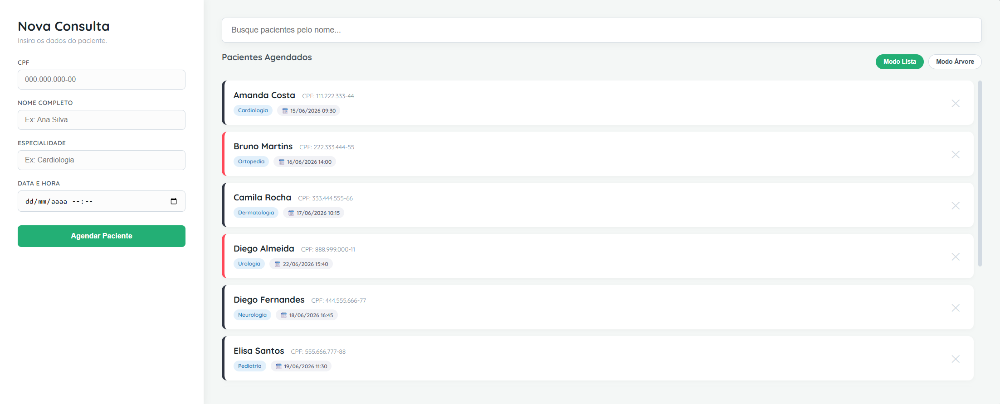
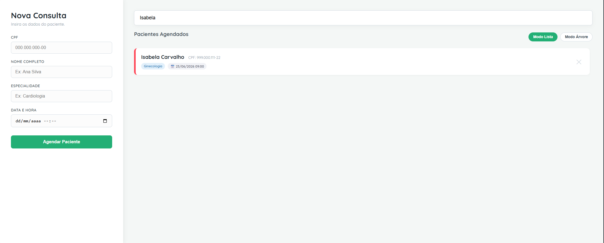
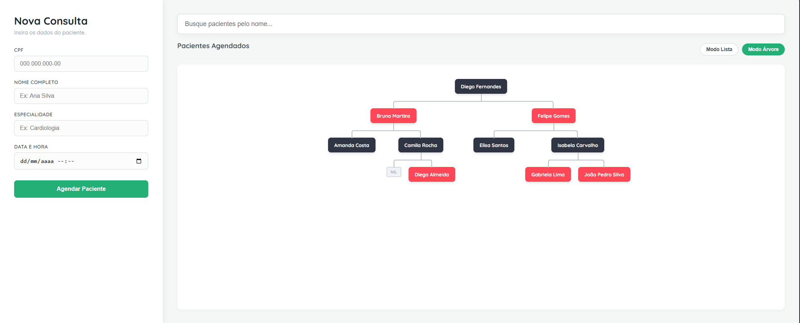

# Agendamentos - Árvore Vermelho-Preto

Número da Lista: 19<br>
Conteúdo da Disciplina: Árvores<br>

## Alunos
|Matrícula | Aluno |
| -- | -- |
| 21/1061860 | Henrique Martins Alencar |

## Vídeo de Apresentação

* https://youtu.be/28arcGtXIxM

## Sobre 

O projeto consiste um um sistema web de agendamento de consultas em uma clínica médica, utilizando uma **Árvore Vermelho-Preto**. O objetivo é demonstrar a eficiência do algoritmo de balanceamento, permitindo buscar, inserir e remover dados da árvore.

## Screenshots

### Lista de Agendamentos



### Busca



### Árvore



## Instalação 
Linguagem: Python, HTML, CSS<br>
Framework: Flask <br>

### Pré-requisitos:

* Python 3.x

* Pip.

### Instalação e execução:

* Clone este repositório:

```bash
git clone https://github.com/eda2-2026/G19_Arvore_EDA2-2026.1
cd G19_Arvore_EDA2-2026.1
```

* Instale as dependências:

```bash
pip install flask
```

* Execute o servidor local:

```bash
python app.py
```

## Uso 

* Acesse o endereço: http://127.0.0.1:5000
* Insira um novo agendamento no formulário;
* Busque um paciente específico na barra de pesquisa;
* Remova um agendamento no paciente desejado;
* Mude para o modo árvore para ver a estrutura de dados em funcionamento.
